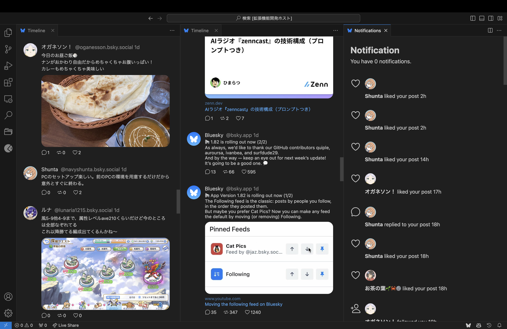
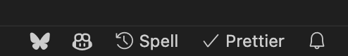

<br />
<div align="center">
  <a href="https://github.com/othneildrew/Best-README-Template">
    
  </a>
  <h3 align="center">BlueRiver</h3>
  <p align="center">
    VSCode client for Bluesky
    <br />
    <a href="https://github.com/othneildrew/Best-README-Template"><strong>View VSCode Marketplace >></strong></a>
    <br />
    <br />
  </p>
</div>

## About



This is a VSCode extension for the client of Bluesky. It has features such as posts, timeline, notifications, and liking. It also has multi-column view and notification status bar. We plan to add more features in the future.

## Installation

1. Install this extension.
2. Set your username and app password to settings.

    We recommend using the app password obtained from the official Bluesky app, which you can get [here](https://bsky.app/settings/app-passwords).

    `"blueriver.user": "xxx.xxx"`

    `"blueriver.password": "xxx-xxx-xxx"`

## Usage

At startup, a status bar is added.
And it can display a list of commands.



-   Timeline

    `blueriver.timeline`

    Displays the home timeline of the logged-in user.

-   Post

    `blueriver.post`

    Edit the text you want to post, select the language of the written text, and post.

-   Like

    `blueriver.like`

    When you run it, your timeline will be displayed and you can select the post you want to like from it.

-   Notifications

    `blueriver.notifications`

    This is a list of notifications for the logged-in user.

-   command list

    `blueriver.list`

    This is a list of commands for this extension.

## Start developing

### Built With

-   VSCode
-   Bluesky API

### Requirement

-   Node.js
-   VSCode

### Installation

Clone the repository.

```
git clone https://github.com/zuk246/BlueRiver.git
```

Install the node module dependencies.

```
npm install
```

When you didn't have vscode, please install vscode from [here](https://code.visualstudio.com/download).

press `F5` or run the command Debug: Start Debugging from the Command Palette (`⇧⌘P`). This will compile and run the extension in a new Extension Development Host window.

### Settings

1. Install this extension.
2. Set your username and app password to settings.

    We recommend using the app password obtained from the official Bluesky app, which you can get [here](https://bsky.app/settings/app-passwords).

    `"blueriver.user": "xxx.xxx"`

    `"blueriver.password": "xxx-xxx-xxx"`

## License

Licensed under the [MIT](LICENSE.md) license.

## Contact

[](https://github.com/zuk246)
[](https://bsky.app/profile/zuk246.net)
[](https://x.com/zuk246)
[](https://www.buymeacoffee.com/zuk246)
