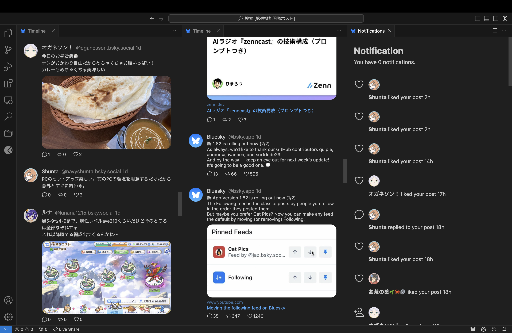
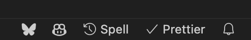

# BlueRiver

This is a VSCode extension for the client of Bluesky. It has features such as posts, timeline, notifications, and liking. It also has multi-column view and notification status bar. We plan to add more features in the future.

## Installation

1. Install this extension.
2. Set your username and app password to settings.

    We recommend using the app password obtained from the official Bluesky app, which you can get [here](https://bsky.app/settings/app-passwords).

    `"blueriver.user": "xxx.xxx"`

    `"blueriver.password": "xxx-xxx-xxx"`

## Usage

At startup, a status bar is added.
And it can display a list of commands.

-   Timeline

    `blueriver.timeline`

    Displays the home timeline of the logged-in user.

-   Post

    `blueriver.post`

    Edit the text you want to post, select the language of the written text, and post.

-   Like

    `blueriver.like`

    When you run it, your timeline will be displayed and you can select the post you want to like from it.

-   Notifications

    `blueriver.notifications`

    This is a list of notifications for the logged-in user.

-   command list

    `blueriver.list`

    This is a list of commands for this extension.

## Links

